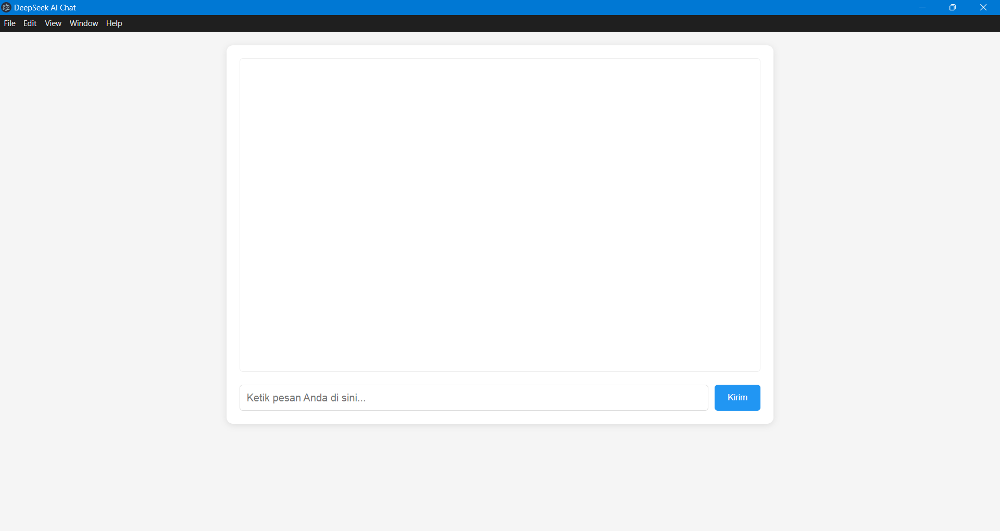

# ElecDeep - Desktop Chat with Local AI

ElecDeep is a simple desktop chat application built with [Electron](https://www.electronjs.org/). It serves as an interface to interact with a locally run AI model (like DeepSeek) through a server that provides an OpenAI-compatible API endpoint, such as [LM Studio](https://lmstudio.ai/).



## Features

* **Simple Chat Interface**: A clean and easy-to-use interface for communicating with the AI.
* **Local Connection**: Connects to a local AI server (default: `http://localhost:1234`), ensuring privacy and full control.
* **Typing Indicator**: Informs the user when the AI is processing and generating a response.
* **Error Handling**: Displays an error message if there's a problem contacting the AI server.
* **Buildable**: Easy to package into a portable desktop application for Windows using `electron-builder`.

## Tech Stack

* [Electron](https://www.electronjs.org/) as the desktop application framework.
* [Node.js](https://nodejs.org/) for the backend process.
* [OpenAI Node.js Library](https://github.com/openai/openai-node) for interacting with the API.
* HTML, CSS, and Vanilla JavaScript for the user interface.

## Prerequisites

Before running this application, ensure you have:
1.  **Node.js and npm**: [Download and install Node.js](https://nodejs.org/en).
2.  **A Local AI Server**: An application like [LM Studio](https://lmstudio.ai/), [Jan](https://jan.ai/), or [Ollama](https://ollama.com/) installed and running.
3.  **An AI Model**: Download and run a compatible model (e.g., `deepseek-r1-distill-qwen-1.5b`) on your local AI server.

## Installation and Running

1.  **Clone this repository:**
    ```bash
    git clone [https://github.com/kangphp/electron-deepseek.git](https://github.com/kangphp/electron-deepseek.git)
    cd electron-deepseek
    ```

2.  **Install dependencies:**
    ```bash
    npm install
    ```

3.  **Run Your Local AI Server:**
    * Make sure the server is running and provides an OpenAI-compatible API at `http://localhost:1234/v1`.
    * Ensure the model you want to use is loaded on the server.

4.  **Run the Electron application:**
    ```bash
    npm start
    ```

## Building the Application

To create a portable executable file (`.exe`) for Windows, run the following command:

```bash
npm run build
```

The build output will be available in the dist folder.

## Configuration
You can change the connection settings for the AI server in the main.js file:

* Server URL: Change the baseURL value in the client object.
* Model Name: Change the model value in the handleChatCompletion function.
* Other Parameters: You can adjust temperature, max_tokens, and other parameters as needed.

```JavaScript
// main.js

// OpenAI client configuration
const client = new OpenAI({
  baseURL: 'http://localhost:1234/v1', // <-- Change the URL here
  apiKey: 'no-key-required',
  // ...
});

// ...

async function handleChatCompletion(message) {
  // ...
  const completion = await client.chat.completions.create({
    model: 'deepseek-r1-distill-qwen-1.5b', // <-- Change the model name here
    messages: [
      // ...
    ],
    temperature: 0.7, // <-- Change parameters here
    max_tokens: 1024,
    // ...
  });
  // ...
}
```

## Project Structure
* main.js: The main file for the Electron main process. Manages the application window and handles backend logic (AI connection).
* index.html: The HTML structure and CSS styling for the chat interface. Also contains the renderer process logic to handle user interaction.
* preload.js: A script that securely bridges the Electron main process and the renderer process.
* package.json: Defines project dependencies, scripts, and metadata.
